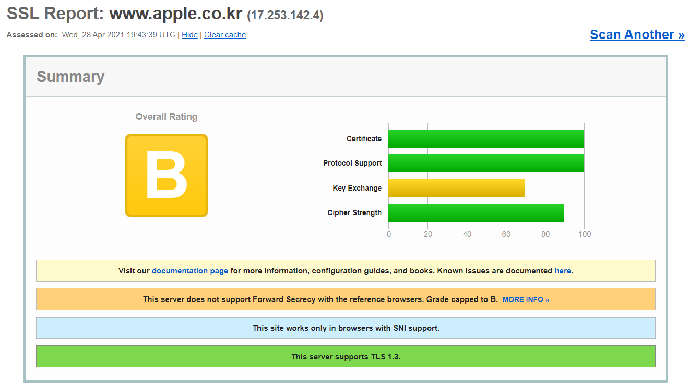

# Presence of vulnerabilities in security protocols such as SSL/TLS
### 2019270132 박미주

## 주제선정이유 ##
    통신프로토콜중 우리가 대부분의 사람들이 흔하게 알고있는 https의 보안프로토콜인 SSL/TLS가 취약점의 존재여부와 취약점이 존재한다면 어떤 취약점으로 인해 공격에 노출되는지 알아보기 위해 주제를 Presence of vulnerabilities in security protocols such as SSL/TLS로 선정하게 되었습니다.

## SSL/TLS란? ##
    SSL/TLS(Security Socket Layer/Transport Layer Security)는 1계층의 IP, 2계층의 TCP, 3계층의 SSL Record Protocol, 4계층의 SSL handshake protocol, SSL cipher change protocol, SSL alert protocol, Application protocol로 구성되어 있고 TCP/IP suites의 Network계층과 Application 계층을 연결하여 동작하며 클라이언트와 서버와의 네트워크통신에서 인증 및 기밀성 지원을 통한 안전한 통신을 위해 개발되었고 SSL/TLS는 https에만 사용되는 것이 아닌 FTP,VPN,VoIP,SIPS,SMTP등 다른 통신 프로토콜등에서도 보안을 위해 사용합니다. TLS는 SSL의 취약한 부분을 보완하여 SSLv3를 계승,발전하여 만들어져 현재는 1.3버전까지 출시되었습니다.

    -----------------------------------------------------------------------------------------
    |    SSL                | SSL                    | SSL            | SSL                 |
    |    handshake protocol | cipher change protocol | alert protocol | aplication protocol |
    -----------------------------------------------------------------------------------------
    |                                              SSL                                      | 
    |                                        Record Protocol                                |
    -----------------------------------------------------------------------------------------
    -----------------------------------------------------------------------------------------
    |                                              TCP                                      | 
    |                                                                                       |
    -----------------------------------------------------------------------------------------
    -----------------------------------------------------------------------------------------
    |                                              IP                                       | 
    |                                                                                       |
    -----------------------------------------------------------------------------------------

## SSL/TLS동작원리 ##
    SSL/TLS는 handshake protocol 과정을 통해서 암호화된 데이터의 교환이 진행되고 기밀성, 무결성, 가용성에 기반한 인증이 진행되기에 handshake protocol은 SSL/TLS에서 가장 중요한 과정이라고 할 수 있습니다. 
    클라이언트가 1차적으로 서버에게 client hello 메시지를 전송하면 서버에서 server hello, certificate, server key exchange, certificate request, server hello done메시지를 전송합니다. 그리고 클라이언트가 서버에게서 받은 메시지를 바탕으로 certificate, client key exchange, certificate verify, change chipher spec, finished메시지를 전송하게 되면 이후 서버에서 change chipher spec,finishedd메시지를 전송함으로써 비대칭 암호화를 통한 인증서 교환이 완료되고 공유키를 이용해 암호화된 통신이 시작됩니다. 

        ClientHello --------> 
                                                ServerHello 
                                                Certificate 
                                                ServerKeyExchange  
                                                CertificateRequest  
                                    <--------   ServerHelloDone 
        Certificate
        ClientKeyExchange 
        CertificateVerify  
        ChangeCipherSpec 
        Finished --------> 
                                                ChangeCipherSpec
                                    <--------   Finished
            애플리케이션 데이터 <---암호화 통신 ---> 애플리케이션 데이터 
   
## SSL/TLS 취약점 확인 및 취약점 공격 ##
 
   # Attack idea of SSL/TLS 취약점 확인 전 
    [1] handshaking 과정에서 중간자의 sniffing을 통한 정보획득
    [2] 암호화 복호화 과정 파악을 통한 역공학기법
    [3] 인증서 위조를 통한 https인증
    예상으로는 가장 일반적으로 사용되는 공격들이 SSL/TLS에서도 동일하게 사용될 것 같습니다.

## Heartbleed Attack 
    Open SSL의 Heatbleed 확장판에서 출시된 Open SSL v1.0.1에서 발견된 취약점으로 인해 서버와 클라이언트간 정보 전송의 확인을 통해 정보를 탈취하는 방법으로 현재는 패치되었습니다.

## POODLE Attack
    TLS버전의 다운그레이드를 통해 이전의 TLS버전이나 SSL버전을 통해 중간자 공격이 가능하도록 하는 공격
    (TLS_FALLBACK_SCSV)패킷을 추가함으로 SSL/TLS의 다운그레이드를 막을 수 있습니다.

## CSS Attack
    handshake과정에서 중간자 공격을 실행하여 암호화된 통신의 트래픽을 수정, 추출, 복호화 하는 공격

## FREAK Attack
    기술적 공격으로 Brute-force 공격을 통한 복호화를 실행하여 RSA키를 획득 후 MITM공격

## Logjam Attack
    TLS연결에서 임시 디피헬만 키교환을 사용하여 연결을 512EXPORT버전 암호화로 변경하여 MITM공격
    대응방법은 2048비트의 디피헬만키를 사용하거나, 타원곡선 디피헬만 암호세트를 사용하여 방어 가능

## DROWN Attack
    SSLv2취약점을 통해 오래되고 약해진 암호화를 통해 RSA를 획득하여 사용하는 공격
    이 공격에 대응하기 위해서는 48바이트의 RSA 평문을 사용해야합니다.

## extra Attack of SSL/TLS Vulnrability 
    [1]Cipher suite 역공격
    [2]Drop ChangeChipherSpec attack
    [3]Version attack
    [4]key exchange algorithm attack
    [5]timing attack
    [6]attacking RSA-Based Sessions in SSL/TLS
    Padding Oracle
    BEAST(Browser Exploit Against SSL/TLS)
    CRIME(Compression Ratio Info-leak Made Easy)
    TIME(Time info-leak Made Easy)
    LUCKY13
    RC4
    BREACH(Browser Reconnaissance and Exfiltration via Adaptive Compression of Hypertext)
    ...
    기존에 예상했던것 보다 훨씬 많은 수의 취약점에 대응한 공격을 발견할 수 있었고 대부분의 취약점들이 버전에 관련된 취약점이나 서버와 클라이언트간 통신에 참여하여 공격을 야기하였습니다.
    
## 몇개의 사이트의 SSL/TLS확인 ##
    [1] "github.com"의 SSL/TLS상태 확인 []
    [2] "sejongkorea.ac.kr"의 SSL/TLS상태 확인 []
    [3] "apple.com"의 SSL/TLS상태 확인 []

    SSL/TLS관리 상태를 확인해보기 위해서 잘 관리 우리가 사용하는 페이지를 선별하여 확인을 진행해본결과 github페이지의 SSL/TLS는 잘 관리 되어 "A+"의 등급을 받은 반면 고려대 세종캠퍼스의 페이지는 TLS는 1.3버전을 사용하고 있지만 DROWN공격(HTTPS를 사용하는 사이트의 오래되어 약화된 암호화로 인해 RSA해독이 가능해짐)에 노출되기 쉬워 등급이 "F"등급으로 SSL/TLS를 통한 암호화로 완벽한 보안이 이루어 지기 어려운것을 나타내고 있습니다. 고려대 세종캠퍼스의 페이지는 DROWN Attack에 대비한 유지보수가 필요합니다. apple의 페이지는 순방향 보안을 사용하여 "B"등급의 결과를 보이는 것을 확인할 수 있습니다. 
    

## 취약점을 줄이기 위한 방법론 ##
    SSL/TLS의 최신버전을 유지하는 것은 필수적이며 사이트들의 SSL/TLS를 확인해본 결과 SSL/TLS의 버전만 항상 최신버전으로 유지보수하는것이 아니라 모든 유지보수에 있어 지속적인 관리가 필요한 것을 확인 할 수 있습니다. SSL/TLS를 통한 HTTPS사용은 HTTPS를 사용한다고 하여 맹신적으로 안전하다고 믿지 않는 자세가 중요하다고 생각합니다. 

## Miju's thinking ##
첫 comments를 보고 다른 주제로 바꾸게 되었는데 security protocol에 대한 Vulnerability 실습과정에서 보유한 리눅스들과 구글에 나온 실습환경들이 같은 조건하에 있지 못해 모든 과정에서 에러를 직면하고 엄청난 양의 많은 암호 알고리즘에 노출되어 너무 어려운 주제를 선택한 것은 아닌가 하였지만 깊이 있는 학습을 하게 된거 같아 보람있는 시간을 가지게 되었습니다.

## [REFERENCES]

[1] Jelena Ćurguz, "VULNERABILITIES OF THE SSL/TLS PROTOCOL" , pp 1-10,https://www.researchgate.net/publication/303563966_Vulnerabilities_of_the_SSLTLS_Protocol

[2] Wassim El-Hajj,"he most recent SSL security attacks: origins,implementation, evaluation, and suggestedcountermeasures", pp 1-12, https://onlinelibrary.wiley.com/doi/epdf/10.1002/sec.295

[3] ran Song Dat Phuc, Changhoon Lee." New Security Approaches for SSL/TLS Attacks Resistance in Practice." pp169-185,https://www.dbpia.co.kr/pdf/pdfView.do?nodeId=NODE07177722

[4]Buzzvil,[버즈빌의 누구나 궁금해하는 개발 이야기] 보안 프로토콜, TLS 1.3,https://www.mobiinside.co.kr/2019/02/13/buzzvil-tls/

[5]오상학. "Empirical analysis of SSL/TLS weaknesses in real websites." 국내석사학위논문 성균관대학교 일반대학원, 2017. 대한민국,http://www.riss.kr/search/download/FullTextDownload.do?control_no=e56fbf2c1d332c5bffe0bdc3ef48d419&p_mat_type=be54d9b8bc7cdb09&p_submat_type=f1a8c7a1de0e08b8&fulltext_kind=a8cb3aaead67ab5b&t_gubun=&convertFlag=&naverYN=&outLink=&nationalLibraryLocalBibno=&searchGubun=true&colName=bib_t&DDODFlag=&loginFlag=1&url_type=&query=Empirical+analysis+of+SSL%2FTLS+weaknesses

https://www.acunetix.com/blog/articles/tls-vulnerabilities-attacks-final-part/

## Heejun Roh's Comments 
 - 주제가 폭이 넓습니다. 다른 학생들의 주제에 대한 코멘트를 보면서 좁히기 바랍니다. Port Scanning의 경우 방향을 잘 잡지 않으면 단순 프로그램 설명서가 되어 버릴 가능성에 주의해야 합니다.
 - 참고문헌을 제대로 읽다보면 좋은 문헌과 나쁜 문헌을 구분할 수 있어야 하며, 굳이 인용할 필요 없는 문헌/나쁜 문헌은 걸러내야 합니다. 1는 읽을 만한 가치가 없어보입니다. 국내 학술대회 논문은 별 이유가 없다면 인용하지 않는 게 좋습니다. 내용이 이상해도, 윤리적으로 심각한 문제(대놓고 표절 등)가 없는 한 모두 발표할 수 있도록 하기 때문입니다. 3은 TCP/IP 설명인데 굳이 참고를 해야 할 부분이 있을지 의문입니다. 4는 인용/참고해도 좋지만 굳이 봐야하나 싶습니다. 5는 인용하지 않는 게 좋습니다. 출판사의 평판이 좋지 않습니다. https://www.cs.sjsu.edu/~stamp/securityJournals.html
